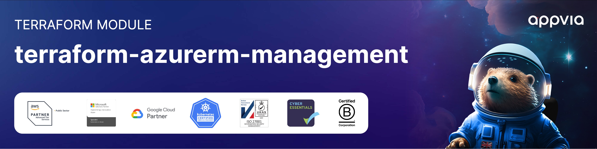

<!-- markdownlint-disable -->

 
 </a>   

<!-- markdownlint-restore -->
<!--
  ***** CAUTION: DO NOT EDIT ABOVE THIS LINE ******
-->

# Terraform Azure Landing Zone Management Module

## Description

The module deploys the [management and monitoring](https://learn.microsoft.com/azure/cloud-adoption-framework/ready/landing-zone/design-area/management) resources from the [conceptual architecture for Azure landing zones](https://learn.microsoft.com/azure/cloud-adoption-framework/ready/landing-zone/#azure-landing-zone-conceptual-architecture) into the specified subscription, based on the configuration supplied. The module also ensures that the specified subscription is placed in the right management group.

## Update Documentation

The `terraform-docs` utility is used to generate this README. Follow the below steps to update:

1. Make changes to the `.terraform-docs.yml` file
2. Fetch the `terraform-docs` binary (https://terraform-docs.io/user-guide/installation/)
3. Run `terraform-docs markdown table --output-file ${PWD}/README.md --output-mode inject .`

<!-- BEGIN_TF_DOCS -->
## Providers

| Name | Version |
|------|---------|
|  [azurerm](#provider\_azurerm) | >= 3.65.0 |

## Inputs

| Name | Description | Type | Default | Required |
|------|-------------|------|---------|:--------:|
|  [management\_resources\_configuration](#input\_management\_resources\_configuration) | Configuration settings for the "management" resources. | <pre>object({     settings = optional(object({       ama = optional(object({         enable_uami                                                         = optional(bool, true)         enable_vminsights_dcr                                               = optional(bool, true)         enable_change_tracking_dcr                                          = optional(bool, true)         enable_mdfc_defender_for_sql_dcr                                    = optional(bool, true)         enable_mdfc_defender_for_sql_query_collection_for_security_research = optional(bool, true)       }), {})       log_analytics = optional(object({         enabled = optional(bool, true)         config = optional(object({           daily_quota_gb                         = optional(number, -1)           retention_in_days                      = optional(number, 30)           enable_monitoring_for_vm               = optional(bool, true)           enable_monitoring_for_vmss             = optional(bool, true)           enable_sentinel                        = optional(bool, true)           enable_change_tracking                 = optional(bool, true)           enable_solution_for_vm_insights        = optional(bool, true)           enable_solution_for_container_insights = optional(bool, true)           sentinel_customer_managed_key_enabled  = optional(bool, false) # not used at this time         }), {})       }), {})       security_center = optional(object({         enabled = optional(bool, true)         config = optional(object({           email_security_contact                                = optional(string, "security_contact@replace_me")           enable_defender_for_app_services                      = optional(bool, true)           enable_defender_for_arm                               = optional(bool, true)           enable_defender_for_containers                        = optional(bool, true)           enable_defender_for_cosmosdbs                         = optional(bool, true)           enable_defender_for_cspm                              = optional(bool, true)           enable_defender_for_key_vault                         = optional(bool, true)           enable_defender_for_oss_databases                     = optional(bool, true)           enable_defender_for_servers                           = optional(bool, true)           enable_defender_for_servers_vulnerability_assessments = optional(bool, true)           enable_defender_for_sql_servers                       = optional(bool, true)           enable_defender_for_sql_server_vms                    = optional(bool, true)           enable_defender_for_storage                           = optional(bool, true)         }), {})       }), {})     }), {})     location = optional(string, "")     tags     = optional(any, {})     advanced = optional(any, {})   })</pre> | n/a | yes |
|  [primary\_location](#input\_primary\_location) | Sets the location for "primary" resources to be created in. | `string` | n/a | yes |
|  [management\_resources\_tags](#input\_management\_resources\_tags) | Specify tags to add to "management" resources. | `map(string)` | <pre>{   "BusinessCriticality": "Mission-critical",   "BusinessUnit": "Platform Operations",   "DataClassification": "General",   "OperationsTeam": "Platform Operations",   "WorkloadName": "ALZ.Management" }</pre> | no |
|  [root\_id](#input\_root\_id) | Sets the value used for generating unique resource naming within the module. | `string` | `"alz"` | no |
|  [use\_oidc](#input\_use\_oidc) | Set to true to enable OIDC authentication for the Azure connection. | `bool` | `true` | no |

## Outputs

| Name | Description |
|------|-------------|
|  [action\_group\_id](#output\_action\_group\_id) | Action Group ID for the "management" resources. |
|  [configuration](#output\_configuration) | Configuration settings for the "management" resources. |
|  [log\_analytics\_workspace\_ids](#output\_log\_analytics\_workspace\_ids) | Log Analytics Workspace ID for the "management" resources. |
|  [subscription\_id](#output\_subscription\_id) | Subscription ID for the "management" resources. |
<!-- END_TF_DOCS -->